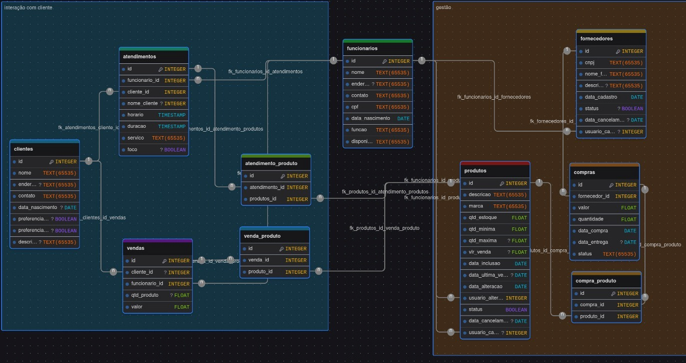
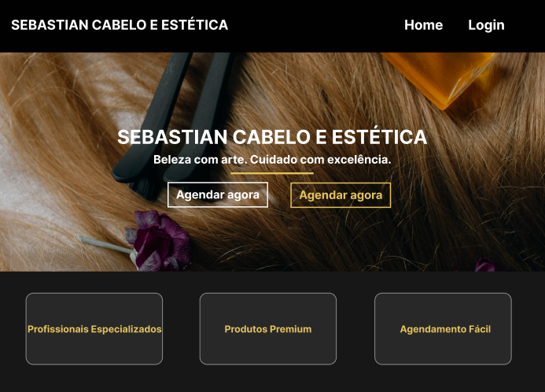

PI – Sebastian Cabelo e Estética Documentação Git

<strong><em>Documentação do PI</em></strong>

  
<strong>📑 Sumário</strong>

- [1. Introdução](#1-introdução)
  - [Objetivos](#-objetivos)
  - [Metodologia](#-metodologia)
- [2. Requisitos](#2-requisitos)
  - [Requisitos funcionais](#-requisitos-funcionais)
  - [Requisitos não funcionais](#-requisitos-não-funcionais)
- [3. Modelo de casos de uso](#3-modelo-de-casos-de-uso)
- [4. Modelo do banco de dados](#4-modelo-do-banco-de-dados)
- [5. Banco de dados](#5-banco-de-dados)
- [6. Diagrama de classes](#6-diagrama-de-classes)
- [7. Estudo de viabilidade](#7-estudo-de-viabilidade)
- [8. Regras de negócio (Modelo canvas)](#8-regras-de-negócio-modelo-canvas)
- [9. Design](#9-design)
- [10. Protótipo](#10-protótipo)
- [11. Aplicação](#11-aplicação)

# 1. Introdução
(Contextualização, Justificativa (porquê?)

## • Objetivos
Desenvolver um sistema que permite gerenciar clientes, registrar atendimentos, realizar a venda de produtos e manter o controle rigoroso de estoque. O sistema deve organizar os serviços prestados e manter um histórico detalhado, sendo estruturado de forma escalável para permitir a inclusão futura de novos profissionais e modalidades de serviços estéticos.

## • Metodologia
As ferramentas e tecnologias utilizadas no projeto estão listadas a seguir
•	Ferramentas/Tecnologias: React, HTML, CSS ,JavaScript, Tailwind CSS
•	Modelo de Processo de Desenvolvimento: Metodologia Ágil (Scrum), Desenvolvimento em Espiral, Prototipação.
•	Ambiente de Trabalho: Desenvolvimento remoto ou em um escritório, utilização de ferramentas de colaboração como GitHub, Trello e Figma.
•	Cronograma: Definição de etapas do projeto e prazos específicos para cada fase (Planejamento, Design, Desenvolvimento, Testes, Implementação).

# 2. Requisitos

## Requisitos funcionais
RF1 – Cadastro de Clientes.
RF2 – Cadastro de Profissionais.
RF3 –  Cadastro de Serviços
RF4 – Agenda de Atendimentos.
RF5 – Registro de Atendimento.
RF6 – Forma de Pagamento.
RF7 – Controle Financeiro.
RF8 – Venda de Produtos.
RF9 – Histórico do Cliente.

## • Requisitos não funcionais
- RNF1 - Usabilidade
- RNF2 - Segurança
- RNF3 - Escalabilidade
- RNF4 - Plataforma
- RNF5 - Manutenibilidade
- RNF6 - Escalabilidade
- RNF7 - Treinamento
- RNF8 - Disponibilidade
- RNF9 - Recuperação de falhas
- RNF10 – Consistência

# 3. Modelo de casos de uso
- Os casos de uso representam as principais interações entre os usuários e o sistema desenvolvido para o salão Sebastian Cabelo e Estética. Eles descrevem as funcionalidades disponíveis na aplicação e demonstram como cada usuário poderá utilizar o sistema durante as atividades do dia a dia.

- Administrador: Responsável pelo gerenciamento geral do sistema, incluindo clientes, profissionais, serviços, agenda, estoque e controle financeiro.

- Funcionário: Responsável por visualizar agenda, registrar atendimentos e consultar informações relacionadas aos clientes.

- Cliente: Usuário responsável por realizar agendamentos e acompanhar informações relacionadas aos serviços.

# 4. Banco de dados
(Modelo conceitual, Modelo lógico, Físico)

 

# 6. Diagrama de classes

 

# 7. Estudo de viabilidade
- O sistema apresenta viabilidade de mercado devido ao crescimento constante da utilização de ferramentas tecnológicas no setor de beleza e estética. Atualmente, muitos salões ainda realizam o gerenciamento de clientes, agendamentos, estoque e controle financeiro de maneira manual ou utilizando plataformas limitadas, o que pode gerar problemas como atrasos, perda de informações, dificuldade de organização e falhas no atendimento.
- Com o aumento da competitividade no segmento, torna-se cada vez mais necessário oferecer um atendimento rápido, organizado e eficiente. Nesse contexto, o sistema Sebastian Cabelo e Estética busca atender essa demanda por meio de uma aplicação moderna, intuitiva e centralizada, permitindo o gerenciamento das principais atividades do salão em uma única plataforma.
- Além disso, o sistema possui potencial de crescimento e adaptação para diferentes tipos de estabelecimentos do ramo estético, podendo futuramente receber novas funcionalidades, integrações e melhorias conforme as necessidades do mercado.

- Viabilidade de recursos: O projeto apresenta viabilidade de recursos, pois utiliza tecnologias acessíveis, gratuitas e amplamente utilizadas no mercado de desenvolvimento web. Entre as principais tecnologias empregadas estão HTML, CSS, JavaScript, React e MySQL, além de ferramentas de apoio como Figma, Draw.io, GitHub, Trello e Visual Studio Code.
- A utilização dessas ferramentas reduz significativamente os custos de desenvolvimento, já que grande parte dos recursos utilizados são gratuitos ou open source. Além disso, os equipamentos disponíveis pela equipe são compatíveis com os requisitos necessários para desenvolvimento, testes e execução da aplicação.
- Outro fator importante é a disponibilidade de materiais de estudo, documentações oficiais e comunidades de suporte relacionadas às tecnologias utilizadas, facilitando o desenvolvimento do sistema e a resolução de possíveis problemas durante a implementação do projeto.
- A equipe também possui conhecimentos básicos e intermediários nas ferramentas utilizadas, permitindo o desenvolvimento gradual das funcionalidades planejadas para a aplicação.

- Viabilidade operacional: O sistema apresenta viabilidade operacional, pois foi desenvolvido com foco em praticidade, organização e facilidade de uso, buscando atender às necessidades do salão Sebastian Cabelo e Estética de forma eficiente.
- A aplicação permite centralizar funcionalidades importantes como cadastro de clientes, gerenciamento de funcionários, controle de serviços, agendamentos, histórico de atendimentos, controle financeiro e gerenciamento de estoque. Essa organização contribui diretamente para a redução de processos manuais e melhora a administração das atividades diárias do salão.
- Além disso, a interface foi planejada utilizando princípios de usabilidade e experiência do usuário (UI/UX), oferecendo uma navegação intuitiva, limpa e organizada. Isso facilita a utilização do sistema tanto por administradores quanto por funcionários e clientes.
- O sistema também apresenta possibilidade de expansão futura, permitindo a inclusão de novos módulos, funcionalidades e melhorias conforme o crescimento do estabelecimento e das necessidades operacionais do negócio.
# 8. Regras de negócio (Modelo canvas)

 

# 9. Design
(Paleta de cor, Tipografia, Logo, Wireframes, Modelo de navegação)
- Paleta de cores: Preto (#000000): utilizado como base principal da interface, transmitindo elegância, exclusividade e modernidade. Branco (#F2F2F2): aplicado em textos e áreas de contraste para melhorar a legibilidade e organização visual.
- Cores segundarias:
- Dourado (#D6B54C): utilizado para destacar elementos importantes da interface, transmitindo luxo e valorização da marca. 
- Cinza Escuro (#2E2E2E): aplicado em formulários, cards e containers para criar profundidade e separação visual entre os componentes. 
- Azul Claro (#4DA3FF): utilizado em botões e ações principais do sistema, reforçando interatividade e dinamismo. 
- Roxo (#4B3FDB): empregado em detalhes específicos da interface para adicionar personalidade visual e modernidade ao sistema. 
- Tipografia: Open Sans, sans-serif 

- Logo: 

 
- Modelo de navegação: 
 

# 10. Protótipo
https://www.figma.com/design/6NKIS1zT65NARQ8eG8e1dj/P.I---Sebastian-Cabelo-e-Est%C3%A9tica?node-id=0-1&p=f&t=traS3DKIbsmv6BMu-0

 

# 11. Aplicação
https://github.com/paulo-m-machado/sistema-cabeleireiro
